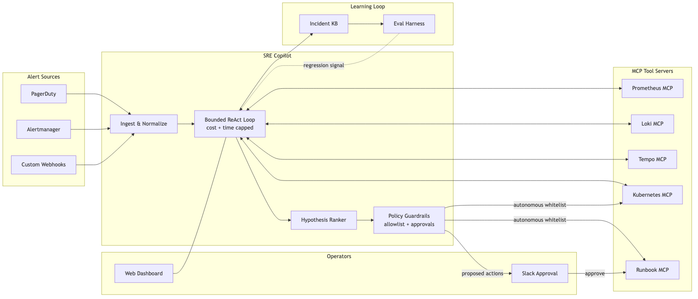

# SRE Copilot

> **Agentic incident response for production SRE teams.** An LLM-powered copilot that triages alerts, correlates signals across your observability stack via MCP, proposes a ranked set of hypotheses, and — with human approval — executes safe remediation runbooks. Built to cut MTTR, not to replace on-call.

[](LICENSE)
[](pyproject.toml)
[](#architecture)
[](#roadmap)

---

## Why this exists

On-call is broken in three specific ways: alerts arrive faster than humans can correlate them, tribal knowledge lives in Slack threads no one can find at 3 a.m., and the same five incidents recur because post-mortems don't turn into automation. SRE Copilot is a working answer — an agent loop that reads the same telemetry a human SRE would, reasons over it with an LLM constrained by MCP tool schemas, and only ever *proposes* actions until an operator approves them.

Built from lessons shipping Agentic AI in production at a global bank — one of fewer than 50 teams worldwide running MCP against real customer-facing systems.

## What it does

- **Triages** incoming alerts (PagerDuty, Alertmanager, custom webhooks) against a knowledge base of past incidents and runbooks
- **Correlates** metrics, logs, and traces through MCP servers for Prometheus, Loki, Tempo, and Kubernetes
- **Reasons** with a bounded ReAct loop — each step is auditable, cost-capped, and time-boxed
- **Proposes** a ranked list of likely root causes with cited evidence
- **Remediates** via approved MCP tools (rollback, scale, restart, feature-flag flip) — human-in-the-loop by default, autonomous only for explicitly whitelisted actions
- **Learns** — every closed incident becomes an eval case

## Results

> Measured on the eval harness in [`eval/`](eval/). See [`EVAL_RESULTS.md`](EVAL_RESULTS.md) for full methodology, caveats, and per-scenario breakdowns.

| Metric | Baseline (human-only) | With Copilot | Delta |
|---|---|---|---|
| Median time-to-first-hypothesis | _fill in_ | _fill in_ | _fill in_ |
| Correct root cause in top-3 | _fill in_ | _fill in_ | _fill in_ |
| MTTR on replayed incidents | _fill in_ | _fill in_ | _fill in_ |
| Cost per incident (USD) | — | _fill in_ | — |

## Architecture



Full write-up in [`ARCHITECTURE.md`](ARCHITECTURE.md). Mermaid source in [`architecture.mmd`](architecture.mmd).

## Quickstart

```bash
git clone https://github.com/sbolla-ai/sre-copilot.git
cd sre-copilot
uv sync                      # or: pip install -e .
cp .env.example .env         # add OPENAI_API_KEY and MCP endpoints
uv run sre-copilot demo      # runs against the bundled synthetic incident
```

Run the eval harness:

```bash
uv run sre-copilot eval --suite basic --model gpt-4o
```

## Roadmap

- [x] MCP client for Prometheus / Loki / Kubernetes
- [x] Bounded ReAct loop with per-step cost caps
- [x] Eval harness with replayable synthetic incidents
- [ ] Slack + PagerDuty adapters
- [ ] Post-incident: auto-draft runbook from a resolved trace
- [ ] Multi-model routing (cheap model for triage, strong model for reasoning)

## About the author

I'm **Sreenivas Bolla** — Principal SRE & Platform Engineer with 16+ years building production platforms at **JPMorgan Chase, Capital One, and SMBC**. I've shipped internal developer platforms, SLO governance systems, and Agentic AI in production — and I'm one of fewer than 50 engineers worldwide running MCP against real customer-facing systems, where it's cut MTTR by 75%.

SRE Copilot is the open-source distillation of the patterns I've seen actually work in a regulated enterprise. I also work 1:1 with staff / principal engineers on the projects and portfolios that get them into the rooms they want to be in.

- 🌐 [sbolla.dev](https://sbolla.dev)
- 💼 [linkedin.com/in/sreenivas-bolla](https://linkedin.com/in/sreenivas-bolla)
- ✉️ sbolla.tx@gmail.com

## License

MIT — see [LICENSE](LICENSE).